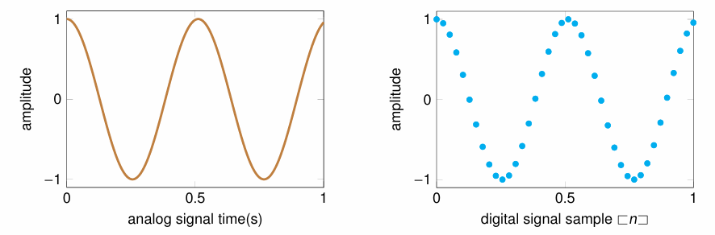

# Short Test 1
João Victor Dell Agli Floriano, 10799783

## Comment on sampling and quantization. Why is it of fundamental importance in signal processing?

Processing signals nowadays is an activity done almost always with the help of computers. Computers store information in the form of discrete data, translated into numbers with a limited range of values, stored in an also limited space, depending on the size available. All of those limitations dictate how we deal with real-life information, as a continuous signal with infinite values could not be stored completely inside a computer, so a solution is required to deal with those incompatibilities. 

Quantization, the best solution presented, is the practice of selecting values from the original continuous signal with a time interval in between every capture. This results in a a grid of well-defined values inside a given interval, that resemble the original shape of the signal:

The quantity of samples taken from a continuous signal is a parameter that depends on the user or the machine that captured them, and even though it may seem like a simple and small detail, it may have great impact on how the signal will be processed. If a user, for example, samples values from an original sigmoid signal with a time interval equal to the period of the signal, it may capture only the same value, and the signal will now resemble more of a constant line than a sigmoid. That is why it is important to define a constant interval of capture that matches the target characteristics of the original signal, so every important detail gets caught in the process. 

In this context, a rule, called *Nyquist criterion* or [*Nyquist frequency*](https://en.wikipedia.org/wiki/Nyquist_frequency) states that, for a given frequency $\omega$, know as the highest frequency of the signal, the sampling rate should be $2\omega$ so that the resulting discretized signal doesn't suffer from the problems exemplified before.